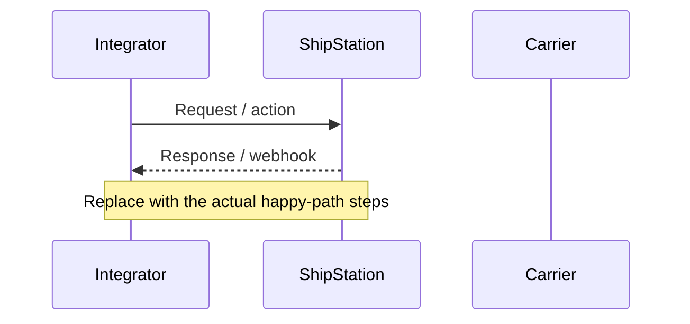
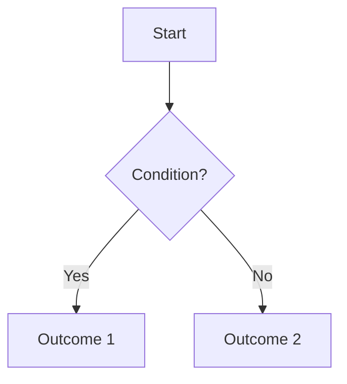

# <Pattern name>

<!--
Inclusion criteria: this is for something you've explained by email more
than once. If it's a one-off question, it doesn't need a pattern doc yet.
Keep the diagram to the happy path / commonly-requested flow — exceptions
and edge cases go in "Notes" at the bottom, not the diagram itself.
-->

## Overview

One or two sentences — the thing you'd say first if someone asked this on
a call.

## Flow



<!-- Swap the sequenceDiagram above for a flowchart if the pattern is more
     about branching logic than a request/response timeline, e.g.:


-->

## References

- Official docs: <link to the relevant ShipStation API/webhook doc page>
- Example payload (if one exists in this repo): [`webhooks/<resource>/<file>.json`](../webhooks/<resource>/<file>.json)

## Notes

- Edge cases, gotchas, or common follow-up questions that don't belong in
  the main happy-path diagram above.
```
