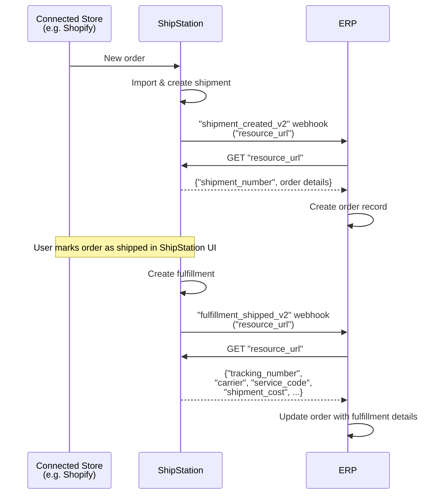

# Store Import to Shipment to Fulfillment — Multi-System Sync

## Short answer

Orders are imported from a connected store (e.g. Shopify) into ShipStation. ShipStation sends a `"shipment_created_v2"` webhook to your ERP. Your ERP calls the `"resource_url"` to retrieve shipment details and creates an order record. When a user marks the order as shipped, ShipStation creates a fulfillment and sends a `"fulfillment_shipped_v2"` webhook to your ERP. Your ERP calls the `"resource_url"` to fetch fulfillment details (`"tracking_number"`, `"carrier"`, `"service_code"`, `"shipment_cost"`) and updates the order.

## Flow

## References

- Example webhook payload: [`webhooks/shipments/new-order-created-v2.json`](../webhooks/orders/new-order-created-v2.json)
- Example resource_url payload: [`webhooks/shipments/new-order-created-v2-resource-url-response.json`](../webhooks/orders/new-order-created-v2-resource-url-response.json)
- Example webhook payload: [`webhooks/fulfillments/fulfillment-shipped-v2.json`](../webhooks/fulfillments/fulfillment-shipped-v2.json)
- Example resource_url payload: [`webhooks/fulfillments/fulfillment-shipped-v2-resource-url.json`](../webhooks/fulfillments/fulfillment-shipped-v2-resource-url.json)

## Notes

- Orders originate in the connected store and ShipStation imports them. The integrator does **not** create shipments via API in this pattern.
- `"shipment_number"` is the order number from the connected store.
- A fulfillment record is created when an order is marked as shipped in ShipStation. The label has been created outside of ShipStation. It contains tracking and carrier information.
- Both `"shipment_created_v2"` and `"fulfillment_shipped_v2"` webhooks contain **pointers only** (`"resource_url"`). Always call `GET "resource_url"` to retrieve full details.
- ShipStation automatically syncs fulfillment and tracking info back to the connected store — your ERP does not need to handle this.
- Useful for keeping your ERP in sync with ShipStation's fulfillment state in near-real-time.
- This pattern can be combined with the [`erp-sync-label-print-ui.md`](../patterns/erp-sync-label-print-ui.md). Both `"label_created_v2"` and `"fulfillment_shipped_v2"` webhooks will fire, allowing your ERP to track label creation and fulfillment separately.
