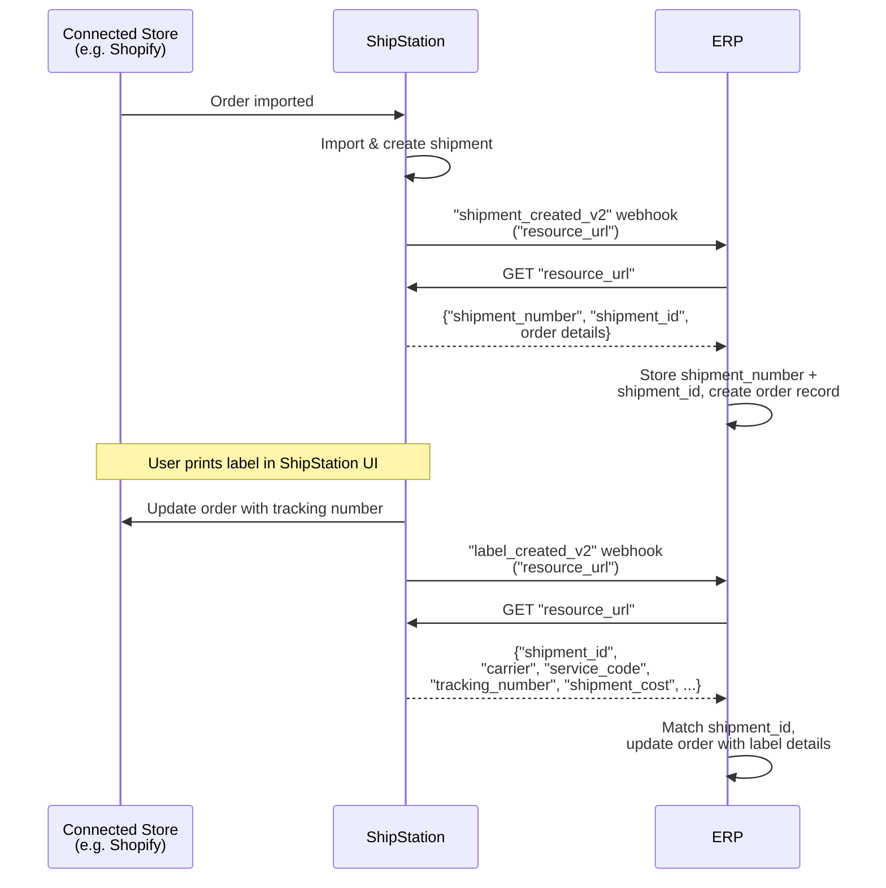

# Store Import to Shipment to Label — Multi-System Sync

## Overview

Orders are imported from a connected store (e.g. Shopify) into ShipStation. ShipStation sends a `"shipment_created_v2"` webhook to your ERP. Your ERP calls the `"resource_url"` to retrieve shipment details and creates an order record. When a user prints the label, ShipStation updates the connected store and sends a `"label_created_v2"` webhook to your ERP. Your ERP calls the `"resource_url"` to fetch label details (`"carrier"`, `"service_code"`, `"tracking_number"`, `"shipment_cost"`) and updates the order.

## Flow

## References

- Example webhook payload: [`webhooks/shipments/new-order-created-v2.json`](../../webhooks/orders/new-order-created-v2.json)
- Example resource_url payload: [`webhooks/shipments/new-order-created-v2-resource-url-response.json`](../../webhooks/orders/new-order-created-v2-resource-url-response.json)
- Example webhook payload: [`webhooks/labels/label-created-v2.json`](../../webhooks/labels/label-created-v2.json)
- Example resource_url payload: [`webhooks/labels/label-created-v2-resource-url.json`](../../webhooks/labels/label-created-v2-resource-url.json)

## Notes

- Orders originate in the connected store and ShipStation imports them. The integrator does **not** create shipments via API in this pattern.
- Store both `"shipment_number"` (the order number from the connected store) and `"shipment_id"` (ShipStation's internal identifier). A single order can spawn multiple shipments due to split shipments, backorders, or cancellations.
- Match incoming label webhooks using `"shipment_id"` from the `GET "resource_url"` response.
- Both `"shipment_created_v2"` and `"label_created_v2"` webhooks contain **pointers only** (`"resource_url"`). Always call `GET "resource_url"` to retrieve full details.
- ShipStation automatically syncs label and tracking info back to the connected store — your ERP does not need to handle this.
- Useful for keeping your ERP in sync with ShipStation's shipment and label state in near-real-time.
- This pattern can be combined with the [`erp-sync-mark-as-shipped.md`](../patterns/erp-sync-mark-as-shipped.md). Both `"label_created_v2"` and `"fulfillment_shipped_v2"` webhooks will fire, allowing your ERP to track label creation and fulfillment separately.
