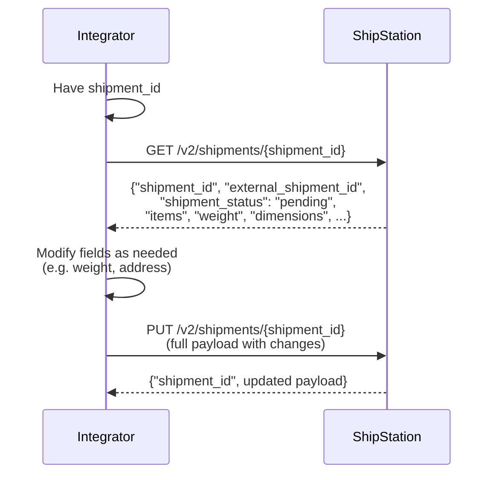

# Shipment Update — Full Payload Required

## Short answer

To update an existing shipment, first retrieve the current shipment record using `GET /v2/shipments/{shipment_id}`. This ensures you have the latest version. Modify the fields you need to change, then send the complete shipment payload to `PUT /v2/shipments/{shipment_id}`. ShipStation requires the full object in updates — partial payloads will fail. **Shipments can only be updated if `shipment_status` is `"pending"`**.

## Flow

## References

- Official docs: [GET /v2/shipments/{shipment_id}](https://docs.shipstation.com/apis/openapi/shipments/get_shipment_by_id)
- Official docs: [PUT /v2/shipments/{shipment_id}](https://docs.shipstation.com/apis/openapi/shipments/update_shipment)

## Notes

- **Shipments can only be updated if `shipment_status` is `"pending"`**. Once a shipment is processed, shipped, or in any other state, it cannot be modified. Check the `shipment_status` field before attempting an update.
- A shipment can originate from a connected store import or via `POST /v2/shipments` — either way, you need the `shipment_id` to update it. How you obtain the `shipment_id` is covered in other patterns.
- Always call `GET /v2/shipments/{shipment_id}` before updating. This retrieves the current state of the record and prevents overwriting fields with stale data.
- The `PUT /v2/shipments/{shipment_id}` endpoint requires the **full shipment object**, not a partial diff. Include all fields from the GET response, with modifications to only the fields you need to change.
- Common update scenarios: modifying recipient address, adding/removing items, updating weight or dimensions, changing carrier or service selection.
