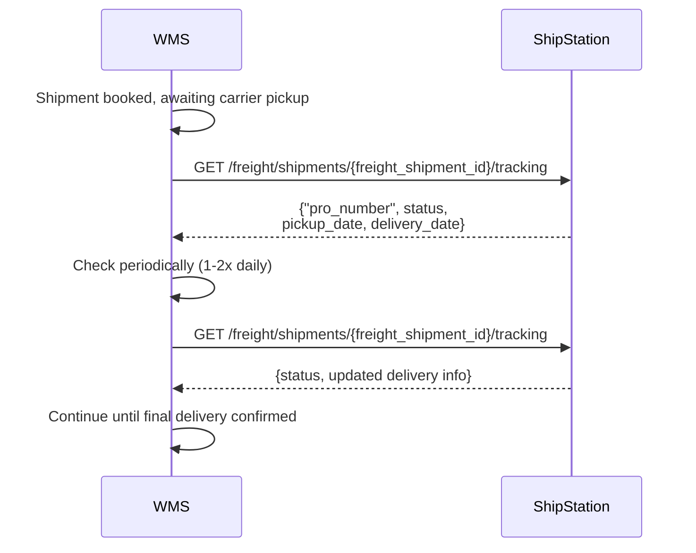

# Freight Shipment Tracking and PRO# Retrieval

## Overview

After a freight shipment is booked and picked up by the carrier, your system calls `GET /freight/shipments/{freight_shipment_id}/tracking` to retrieve the Pro number (if not already provided at booking) and current tracking status. You can continue to query this endpoint periodically throughout the shipment lifecycle to monitor status through final delivery.

## Flow

## References

- Official docs: [GET /freight/shipments/{freight_shipment_id}/tracking](https://docs.shipstation.com/apis/openapi/freight/get_freight_shipment_tracking)
- Official docs: [GET /freight/shipments](https://docs.shipstation.com/apis/openapi/freight/list_freight_shipments)

## Notes

- **Prerequisite**: You must have the `freight_shipment_id` from the initial `POST /freight/shipments` booking response to query tracking. If you need to retrieve a shipment ID, use `GET /freight/shipments` to list available freight shipments and find the one matching your order based on `bol_number`.
- Use this endpoint to retrieve the Pro number if it was not provided in the initial booking response.
- ShipStation does not emit webhooks for freight shipments, so polling is required to monitor shipment status.
- **Polling frequency**: Check this endpoint 1-2 times per day. Freight shipments move significantly slower than parcel shipments and status updates are infrequent. More frequent polling adds unnecessary load without additional benefit.
- The response includes `"pro_number"`, current status (e.g., in transit, out for delivery), estimated/actual delivery date, and other tracking details provided by the carrier.
- Continue periodic queries through the shipment lifecycle until final delivery is confirmed.
- Sync shipment status updates back to your order source system or WMS dashboard as needed for fulfillment visibility.
