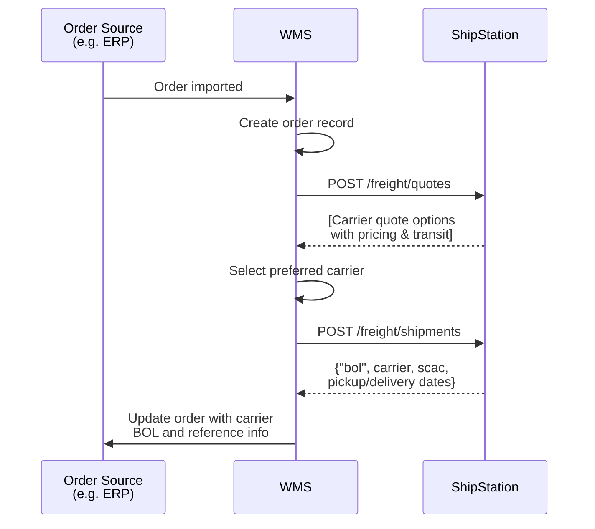

# Freight Quote and Book

## Overview

Orders are pushed to your WMS from an external system (e.g. ERP). Your WMS calls `POST /freight/quotes` to retrieve LTL carrier options. After selecting a preferred carrier based on cost or other criteria, your WMS calls `POST /freight/shipments` to book the shipment. ShipStation returns shipment details including Bill of Lading (`"bol"`) and carrier reference information. Your WMS updates the order source with carrier and shipment reference information. Optionally, retrieve shipment documents (BOL, labels, etc.) via `GET /freight/shipments/{freight_shipment_id}/documents`.

## Flow

## References

- Official docs: [POST /freight/quotes](https://docs.shipstation.com/apis/openapi/freight/get_freight_quotes)
- Official docs: [POST /freight/shipments](https://docs.shipstation.com/apis/openapi/freight/book_freight_shipment)
- Official docs: [GET /freight/shipments/{freight_shipment_id}/documents](https://docs.shipstation.com/apis/openapi/freight/list_freight_shipment_documents)
- Official docs: [DELETE /freight/shipments/{freight_shipment_id}](https://docs.shipstation.com/apis/openapi/freight/cancel_freight_shipment)

## Notes

- Freight quotes are retrieved via POST request. Include shipment attributes in the payload: weight, dimensions, origin/destination postal codes, freight class code, commodity type.
- ShipStation does not currently have an endpoint for density calculation (to aid with class calculation).
- `POST /freight/quotes` returns available LTL carriers with line-haul pricing, accessorial charges, and estimated transit time. Your WMS applies business logic to select the best rate (lowest cost, fastest delivery, preferred carrier, weight class optimization etc.).
- After selecting a carrier, call `POST /freight/shipments` to confirm the booking. The response includes `"bol"` (Bill of Lading), `"scac"` (Standard Carrier Alpha Code), and pickup/delivery dates. **Pro number may or may not be returned at booking time — availability varies by carrier.**
- **Retrieving documents**: Use `GET /freight/shipments/{freight_shipment_id}/documents` to retrieve BOL, labels, and other shipment documents after booking. Useful if your system requires downstream document handling or printing.
- **Cancellation**: If a shipment must be cancelled before pickup, use `DELETE /freight/shipments/{freight_shipment_id}`. Cancellation availability depends on carrier and shipment status.
- Your WMS is responsible for syncing carrier, BOL, and shipment reference data back to the order source system.
- Useful for warehouse systems handling LTL/freight shipments that require full carrier control and cost optimization.
