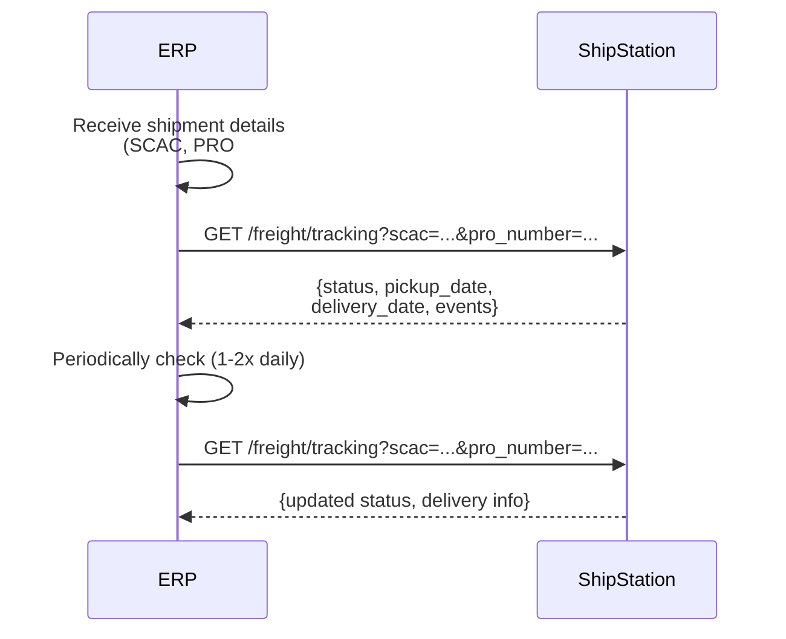

# Track Freight

## Overview

Your ERP can track any LTL shipment regardless of origin — whether created in ShipStation or booked directly with a carrier. By providing the carrier's SCAC code and either a Pro number or BOL number, your ERP calls `GET /freight/tracking` to retrieve current tracking status and delivery information. Useful for inbound freight, drop-shipments, or freight managed outside ShipStation.

## Flow

## References

- Official docs: [GET /freight/tracking](https://docs.shipstation.com/apis/openapi/freight/get_freight_tracking)

## Notes

- **No ShipStation shipment required**: This endpoint queries carrier networks directly, not ShipStation's database. Use it to track freight booked outside ShipStation or inbound shipments from suppliers.
- **Required parameters**: Provide either `pro_number` OR `bol_number` along with `scac` (Standard Carrier Alpha Code).
- Use periodically (1-2x daily) to monitor status through final delivery. Freight status updates are infrequent.
- Sync tracking updates back to your ERP or supply chain visibility system.
