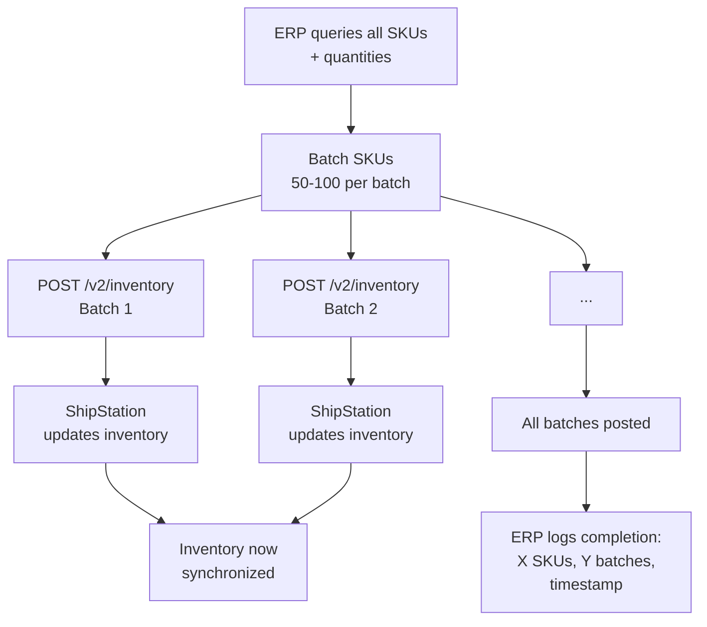

# Initial Inventory Upload

## Overview

On first connection or when full inventory resync is needed (disaster recovery, migration), the ERP exports all SKUs with current quantities across all warehouses and bulk-uploads them to ShipStation via `POST /v2/inventory`. Batching is used to keep API usage efficient while staying within rate limits.

## Flow



## References

- Official docs: [Manage Inventory Levels](https://docs.shipstation.com/manage-inventory-levels)
- API docs: [POST /v2/inventory](https://docs.shipstation.com/apis/openapi/inventory/update_inventory)

## Notes

- **When to use:** First-time setup after onboarding, disaster recovery, periodic full resync, or migration from another shipping platform to ShipStation.

- **Idempotent:** Re-running this pattern should reach the same end state. ShipStation's `POST /v2/inventory` overwrites quantities, so running twice with the same data produces the same result.

- **Batch size tuning:** Start with 50 SKUs per batch and test. Larger batches (100+ SKUs) reduce API calls but increase payload size. Find the sweet spot for your infrastructure.

- **Example rate limit impact:** Uploading 5000 SKUs at 50 per batch = 100 API calls. Running this off-peak (e.g., Sunday morning) uses ~100 of your 200 rpm budget for that hour. If running during business hours alongside order/label operations, stagger it or run in smaller batches.

- **Handling missing SKUs:** If the ERP has a SKU that ShipStation doesn't yet have (no shipment was ever created for it), ShipStation will return an error for that SKU. Log the error and investigate: either create a dummy shipment in ShipStation first, or manually add the SKU. Don't halt the upload; continue with other SKUs.

- **Warehouse mapping:** Ensure the ERP knows which `inventory_warehouse_id` corresponds to each warehouse/location. Run [`erp-inventory-warehouse-setup.md`](./erp-inventory-warehouse-setup.md) first to populate these mappings.

- **Audit trail:** Log the upload:
  ```
  {
    "event": "inventory_upload_complete",
    "timestamp": "2026-09-08T15:30:00Z",
    "sku_count": 5000,
    "batch_count": 100,
    "warehouses": ["w-12345", "w-67890", "w-11111"],
    "duration_seconds": 420
  }
  ```
  Reference this log during reconciliation to confirm data was sent.

- **SKU quantity validation:** Before posting, validate quantities are non-negative integers. ShipStation may reject negative or fractional quantities.

- **Multi-warehouse:** If a SKU exists in 2 warehouses (DC Chicago + DC LA), the payload will have 2 entries for that SKU (one per warehouse). Send them together or in separate batches; both work.

- **Partial success:** If 1 batch fails (e.g., rate limited), retry that batch alone; don't re-upload all 5000 SKUs. Dead-letter failed batches and retry later.

- **Timing:** This operation is one-time or infrequent. Schedule it off-peak (nights, weekends) to avoid competing with order/label/rating operations during peak hours.

- **Reconciliation after upload:** After initial upload completes successfully, consider running [`erp-inventory-periodic-reconciliation.md`](./erp-inventory-periodic-reconciliation.md) the next day to verify ShipStation received all updates correctly.
