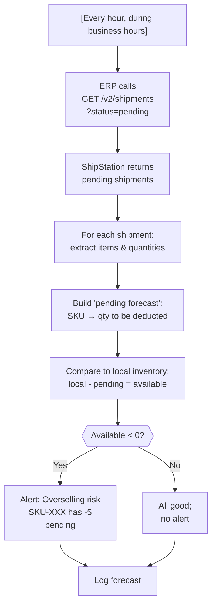

# Pending Shipment Visibility

## Overview

Optionally, the ERP periodically queries ShipStation for pending shipments (not yet marked shipped) to forecast what inventory *will* be deducted when labels are created. This provides visibility into the gap between "ERP thinks it has X" and "SS will deduct X" and can alert on overselling risk. It's a monitoring/forecasting tool, not a corrective mechanism.

## Flow



## References

- Official docs: [List Shipments](https://docs.shipstation.com/apis/openapi/shipments/list_shipments)
- API docs: [GET /v2/shipments?status=pending](https://docs.shipstation.com/apis/openapi/shipments/list_shipments)
- Related pattern: [`erp-inventory-periodic-reconciliation.md`](./erp-inventory-periodic-reconciliation.md) (uses pending data to explain discrepancies)

## Notes

- **Optional pattern:** This is not required for basic inventory sync. It's an enhancement for visibility and alerting. If inventory overselling is not a concern, skip this pattern.

- **Visibility tool, not corrective:** The pending forecast helps you *understand* the inventory situation, but it doesn't change anything. It's read-only; no API writes. The reconciliation pattern handles corrections.

- **Why it matters:** 
  ```
  Real situation (2 PM):
    Local ERP inventory: 50 units
    ShipStation inventory: 48 units
    Pending shipments: 2 units (label not yet printed, but shipment created)
  
  Without pending visibility:
    → Why is SS 2 less? Unknown
  
  With pending visibility:
    → Ah, 2 units are about to ship. Makes sense.
    → No alert needed; not unexpected
  ```

- **Overselling alert example:**
  ```
  Local ERP inventory: 50 units
  Pending shipments: 75 units (oops, we promised more than we have)
  Alert: "SKU-001 oversold by 25 units"
  → Investigate: did the ERP lose track of inventory? Are pending shipments stale?
  ```

- **Frequency:** Run during business hours when orders are being created and labels printed. Examples:
  - Hourly from 8 AM - 6 PM (peak fulfillment)
  - Every 30 min if very high velocity
  - Daily off-peak if low velocity

- **Rate limit impact:** Minimal. GET /v2/shipments with `status=pending` is paginated. Assuming 1000 results per page and 10K pending shipments total:
  ```
  GET /v2/shipments?status=pending: ~10 calls (1000 per page)
  Hourly: 10 calls/hour × 8 hours = 80 calls/day
  Even at worst case (hourly forever): 80 × 30 days = 2400 calls/month = 54 req/min average
  Acceptable within the 200 rpm limit
  ```

- **Stale pending shipments:** A shipment can remain pending indefinitely if:
  - Order was created but label not yet printed (user hasn't clicked "print" in SS UI)
  - Order is on hold or awaiting customer confirmation
  - System is confused (rare)
  
  The forecast will include these, inflating the "about to ship" count. To handle this:
  - Filter pending shipments by age: only include created < 24 hours ago (optional)
  - Or accept that forecast is conservative (assumes everything pending will ship)

- **Caching:** Cache the pending forecast locally. Don't re-query if no new orders came in. Example:
  ```
  Last pending query: 1 hour ago, returned 50 units pending
  Last order received: 2 hours ago
  → Reuse cached forecast; don't query again yet
  
  New order received (2:30 PM)
  → Next hourly refresh will include it
  ```

- **Correlation with reconciliation:** During reconciliation (e.g., 2 AM), pending shipments are usually near zero (all orders from the day were already fulfilled). But if there's a backlog:
  ```
  Reconciliation at 2 AM:
    Local: 50
    SS: 45
    Pending: 5
  → 5 pending shipments explain the -5 delta
  → Don't alert; this is expected
  ```

- **Audit trail:** Log the pending forecast:
  ```
  {
    "event": "pending_shipment_forecast",
    "timestamp": "2026-09-08T14:00:00Z",
    "pending_shipment_count": 150,
    "sku_count": 45,
    "total_units_pending": 320,
    "pending_by_sku": [
      {sku: "ABC-001", qty: 50},
      {sku: "ABC-002", qty: 30},
      ...
    ],
    "oversells_detected": 0,
    "duration_ms": 220
  }
  ```

- **Alert thresholds:** Decide when to alert:
  - **Threshold 1:** Any SKU with (available inventory < 0) → always alert
  - **Threshold 2:** Total pending > X% of inventory → alert if pending > 50% (customize)
  - **Threshold 3:** Specific SKU pending > X units → alert if any pending > 100 units (customize)

- **Integration with reconciliation:** The pending forecast is a supporting tool for reconciliation. If reconciliation finds a large discrepancy, the pending forecast helps explain it:
  ```
  Reconciliation found: Local 50, SS 45, delta -5
  Pending forecast: 5 units pending
  → Likely: 5 units were deducted (labels created) between last sync and reconciliation
  → Conclusion: no alert needed; this is normal fulfillment
  ```

- **Fallback without this pattern:** If you don't implement this pattern, reconciliation will still work. You just won't have early warning of overselling. The daily reconciliation will catch it, but it's reactive rather than proactive.

- **Enhancement: correlate to orders:** If the ERP tracks which orders map to which ShipStation shipments, you can correlate pending shipments to orders:
  ```
  "PO-12345 has 2 units pending ship"
  vs.
  "SKU-ABC-001 has 50 units pending ship"
  → More actionable for ops
  ```
  This requires additional data structures; basic pattern is per-SKU.
