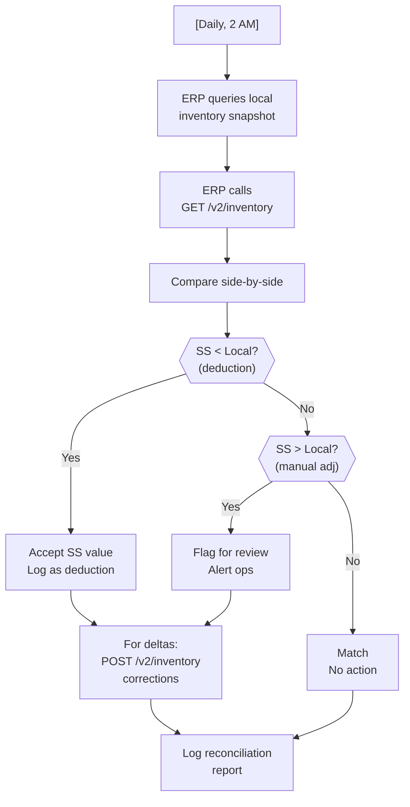

# Periodic Reconciliation

## Overview

On a schedule (daily, hourly, or weekly), the ERP compares its inventory against ShipStation's via `GET /v2/inventory`, identifies discrepancies, and selectively updates ShipStation. This pattern catches drift caused by real-time sync failures, ShipStation inventory deductions from UI label creation, and manual adjustments. It's the safety net that guarantees eventual consistency.

## Flow



## References

- Official docs: [Manage Inventory Levels](https://docs.shipstation.com/manage-inventory-levels)
- API docs: [GET /v2/inventory](https://docs.shipstation.com/apis/openapi/inventory/list_inventory_by_sku)
- API docs: [POST /v2/inventory](https://docs.shipstation.com/apis/openapi/inventory/update_inventory)
- Related pattern: [`erp-inventory-real-time-sync.md`](./erp-inventory-real-time-sync.md) (what it reconciles)

## Notes

- **Why reconciliation is mandatory:** ShipStation deducts inventory automatically when labels are created (in the UI or via API). The ERP doesn't learn about this until reconciliation compares the two. Without reconciliation, the ERP can oversell (thinks it has 50 units; SS already shipped 5). Reconciliation is the only mechanism that detects this.

- **Recommended frequency:** Daily (e.g., 2 AM) is the default. Adjust based on risk tolerance:
  - **Daily:** Acceptable lag of ~24 hours during peak fulfillment. Cheap on API. Suitable for most e-commerce.
  - **Hourly:** Tighter consistency; more API calls (~15-20 per hour). Use for high-value goods or just-in-time inventory.
  - **Weekly:** Loose; only for very low-velocity environments. Risk of overselling is higher.

- **Rate limit impact:** Negligible when run off-peak (2 AM). Example:
  ```
  GET /v2/inventory (5000 SKUs, paginated 1000 per page): 5 calls
  POST /v2/inventory (corrections, only deltas, assume 20 SKUs): 10 calls
  Total: 15 calls
  Impact at 2 AM: negligible; even if run hourly, 15 × 24 = 360 calls/day, well under limit
  ```

- **Acceptance policy:** When you find a discrepancy:
  ```
  Local: SKU-001: 50 units
  SS:    SKU-001: 48 units
  Discrepancy: SS has 2 fewer
  
  Action: Accept SS as authoritative
  Reason: SS deducted because labels were created; it's fresher
  ```
  
  Reverse case:
  ```
  Local: SKU-002: 100 units
  SS:    SKU-002: 105 units
  Discrepancy: SS has 5 MORE
  
  Action: Flag for review
  Reason: Possible manual adjustment in SS UI; ERP doesn't know why
  Decision: 
    - Option A: Overwrite SS with Local value (ERP wins)
    - Option B: Accept SS value and log (SS wins)
    - Option C: Post to Slack/alert and wait for human review
  ```
  
  Choose the policy that fits your business. Document it.

- **Selective updates:** Only POST corrections for SKUs with delta. Don't re-upload all 5000 SKUs; that's wasteful and noisy. Example:
  ```
  Deltas found:
    SKU-001: -2 (SS < Local, accept)
    SKU-002: +5 (SS > Local, flag)
    SKU-003: -0 (no delta, skip)
  
  POST /v2/inventory:
    Only SKU-001 and SKU-002 (2 updates, not 5000)
  ```

- **Handling warehouse mappings:** Ensure the ERP has stored all `inventory_warehouse_id` values from [`erp-inventory-warehouse-setup.md`](./erp-inventory-warehouse-setup.md). If a warehouse is missing from the mapping, it won't be reconciled. Alert if any warehouses are excluded.

- **Snapshot timing:** Ideal scenario:
  ```
  T=2:00:00 UTC: ERP queries local inventory → snapshot A
  T=2:00:30 UTC: ERP calls GET /v2/inventory → snapshot B
  → Compare A vs B
  ```
  Both snapshots are taken within 30 seconds; acceptable. If there's significant clock drift or network delay, timestamps may diverge; document this in logs.

- **Large discrepancies:** Alert if any SKU has a delta > 10% or > 100 units. May indicate:
  - Data corruption
  - Clock skew (timestamps mismatch)
  - ERP-side inventory bug
  - Manual adjustments in SS or ERP not logged
  
  Example alert:
  ```
  {
    "severity": "warning",
    "sku": "EXPENSIVE-ITEM-001",
    "local": 50,
    "shipstation": 35,
    "delta": -15,
    "delta_percent": 30,
    "message": "Large discrepancy detected; possible data issue"
  }
  ```

- **Audit trail:** Log the full reconciliation report:
  ```
  {
    "event": "inventory_reconciliation_complete",
    "timestamp": "2026-09-08T02:00:00Z",
    "sku_count_checked": 5000,
    "discrepancy_count": 12,
    "corrections_applied": 10,
    "flags_for_review": 2,
    "large_discrepancies": 1,
    "duration_seconds": 180,
    "details": [
      {
        "sku": "ABC-001",
        "local": 50,
        "shipstation": 48,
        "delta": -2,
        "action": "accepted_ss"
      },
      ...
    ]
  }
  ```
  Store these reports for compliance and troubleshooting.

- **Failure handling:** If GET /v2/inventory fails:
  - Retry with exponential backoff
  - After 3 failures: alert ops
  - Don't push any corrections until you can read SS state
  - Reconciliation can be retried the next day

- **Destination of corrections:** When you decide to POST corrections, decide: update ShipStation to match ERP, or update ERP to match ShipStation?
  - **ERP → SS:** (recommended) Push ERP corrections to SS. Assumes ERP is source of truth.
  - **SS → ERP:** Update ERP database to match SS. Riskier; assumes SS is more accurate.
  - **Hybrid:** If SS < Local, accept SS (inventory deducted). If SS > Local, ask for human review.

- **Frequency tuning:** Start with daily (2 AM). If overselling becomes a problem or you want tighter consistency, increase to hourly. Monitor the reconciliation reports to understand discrepancy patterns; they inform the frequency decision.

- **Optional: Pending shipment correlation:** Before reconciliation runs, optionally query `GET /v2/shipments?status=pending` to forecast what will be deducted. This helps explain discrepancies:
  ```
  "ERP has 50, SS has 48, delta -2"
  "Pending shipments contain 3 units of SKU-001"
  → Likely: 2 units already shipped (labels created); 1 unit pending
  → Make sense; no alert needed
  ```

- **Reconciliation after recovery:** If ShipStation has an outage and you want to resync afterward, consider running a full reconciliation immediately (not waiting for the scheduled time).

- **Dead-letter for corrections:** If a POST correction fails, store it in a dead-letter queue and retry. Don't silently drop failed corrections.

- **Monitoring:** Alert if reconciliation takes > 10 minutes (indicates slow API or large inventory). Also alert if reconciliation doesn't run (cron job failed; worker stuck).

- **Relationship to real-time sync:** Real-time sync (queue + batch) keeps inventory roughly in sync throughout the day. Reconciliation is the nightly catch-all. Together, they provide eventual consistency with tight bounds (within 5 min during day, catch-all at night).
