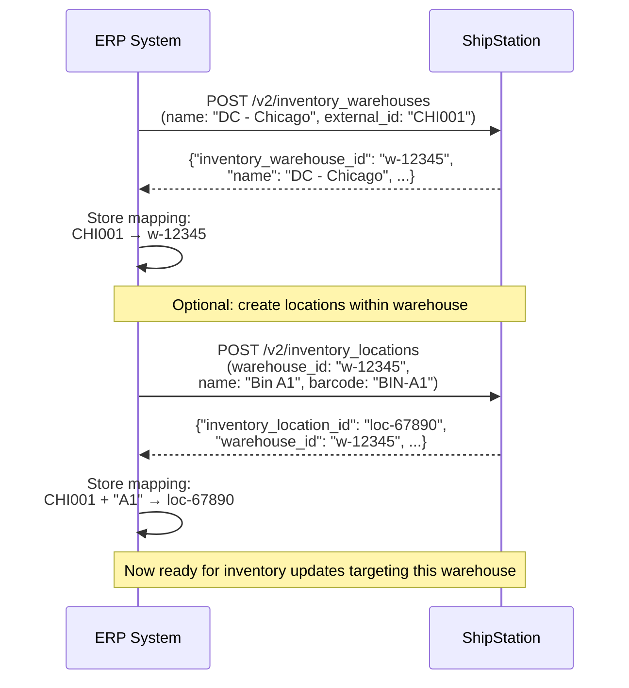

# Warehouse/Location Setup

## Overview

Each physical warehouse or fulfillment location in the ERP must be represented in ShipStation. The ERP creates warehouses via `POST /v2/inventory_warehouses`, stores the returned `inventory_warehouse_id` for future operations, and optionally creates locations (bins/racks) within each warehouse.

## Flow

## References

- Official docs: [Manage Inventory Warehouses](https://docs.shipstation.com/manage-inventory-warehouses)
- Official docs: [Manage Inventory Locations](https://docs.shipstation.com/manage-inventory-locations)
- API docs: [POST /v2/inventory_warehouses](https://docs.shipstation.com/apis/openapi/inventory-warehouses/create_inventory_warehouse)
- API docs: [POST /v2/inventory_locations](https://docs.shipstation.com/apis/openapi/inventory-locations/create_inventory_location)

## Notes

- **Prerequisite:** This pattern must run before any of the inventory sync patterns (initial upload, real-time sync, reconciliation).

- **Idempotent:** Warehouse creation can be re-run safely. If warehouse already exists, handle the response error gracefully and look up the existing `inventory_warehouse_id`.

- **External ID field:** Consider storing your ERP warehouse code in ShipStation's `external_id` field (if available in the API payload) or a custom field. This makes it easier to detect existing warehouses on re-sync without maintaining a separate mapping table.

- **Warehouse vs. Location:** Warehouses are physical facilities (DC Chicago, DC Los Angeles). Locations are subdivisions within a warehouse (Bin A1, Bin B3, Shelf 5). Locations are optional; not all integrations need them. If your ERP doesn't track bin-level inventory, create the warehouse and skip locations.

- **Multi-site scenario:** If the ERP has 3 physical locations, run this pattern 3 times (once per location). Store all 3 `inventory_warehouse_id` mappings.

- **Warehouse ID persistence:** Don't assume `inventory_warehouse_id` will remain the same across resyncs or ShipStation updates. Always query and re-store the mapping.

- **Deletion:** Use `DELETE /v2/inventory_warehouses/{inventory_warehouse_id}` if a warehouse must be removed. Understand ShipStation's cascade behavior (can a warehouse with inventory be deleted?). Test this in a sandbox first.

- **Warehouse name changes:** Use `PUT /v2/inventory_warehouses/{inventory_warehouse_id}` to update warehouse name or barcode if the ERP name changes.

- **Rate limit impact:** Warehouse setup is one-time; negligible API usage (typically 1-3 calls total per ERP connection).
