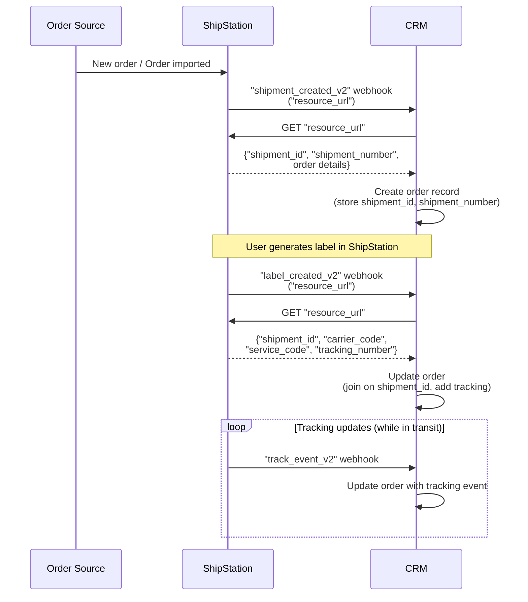

# Order Lifecycle Sync to CRM

## Overview

When orders are imported to ShipStation, a `"shipment_created_v2"` webhook notifies your CRM. Your CRM creates an order record, capturing `"shipment_id"` and `"shipment_number"`. When a label is generated, a `"label_created_v2"` webhook provides carrier, service, and `"tracking_number"` — your CRM joins on `"shipment_id"` to update the order. As the shipment travels, `"track_event_v2"` webhooks arrive with delivery events; your CRM uses `"tracking_number"` to link and update order status. If a return label is needed, your CRM can create one via `POST /v2/labels/return-label` using the `shipment_id`. For cancellations (no webhook exists), periodically poll `GET /v2/shipments/{shipment_id}` to check status.

## Flow

## References

- Example webhook payload: [`webhooks/orders/new-order-created-v2.json`](../../webhooks/orders/new-order-created-v2.json)
- Example resource_url payload: [`webhooks/orders/new-order-created-v2-resource-url-response.json`](../../webhooks/orders/new-order-created-v2-resource-url-response.json)
- Example webhook payload: [`webhooks/labels/label-created-v2.json`](../../webhooks/labels/label-created-v2.json)
- Example resource_url payload: [`webhooks/labels/label-created-v2-resource-url.json`](../../webhooks/labels/label-created-v2-resource-url.json)
- Example webhook payload: [`webhooks/tracking/usps/track-event-v2-delivered.json`](../../webhooks/tracking/usps/track-event-v2-delivered.json)
- Official docs: [POST /v2/labels/return-label](https://docs.shipstation.com/apis/openapi/labels/create_return_label)
- Official docs: [GET /v2/shipments/{shipment_id}](https://docs.shipstation.com/apis/openapi/shipments/get_shipment_by_id)

## Notes

- Store both `"shipment_id"` and `"shipment_number"` when you receive the `"shipment_created_v2"` webhook. Use `"shipment_id"` to join with `"label_created_v2"` payload. To track, key off the `tracking_number`.
- `"track_event_v2"` webhooks only fire when the label is generated in ShipStation. If an order is marked as shipped via the fulfillment flow, no tracking events will be sent.
- Track event payloads contain data inline — there is no resource_url to call. Process tracking data directly from the webhook.
- **No cancellation webhook exists**. If significant time has passed since shipment creation, periodically call `GET /v2/shipments/{shipment_id}` to check for `"shipment_status": "cancelled"` and update your CRM accordingly.
- Return labels can be created via `POST /v2/labels/return-label` using the `"shipment_id"`. Return labels do **not** generate `label_created_v2` webhooks.
- Tracking number linking: use `"tracking_number"` from the `"label_created_v2"` webhook to link subsequent `"track_event_v2"` events to the correct order.
- Useful for maintaining a complete order-to-delivery audit trail in a CRM, including carrier, service, and real-time tracking updates.
