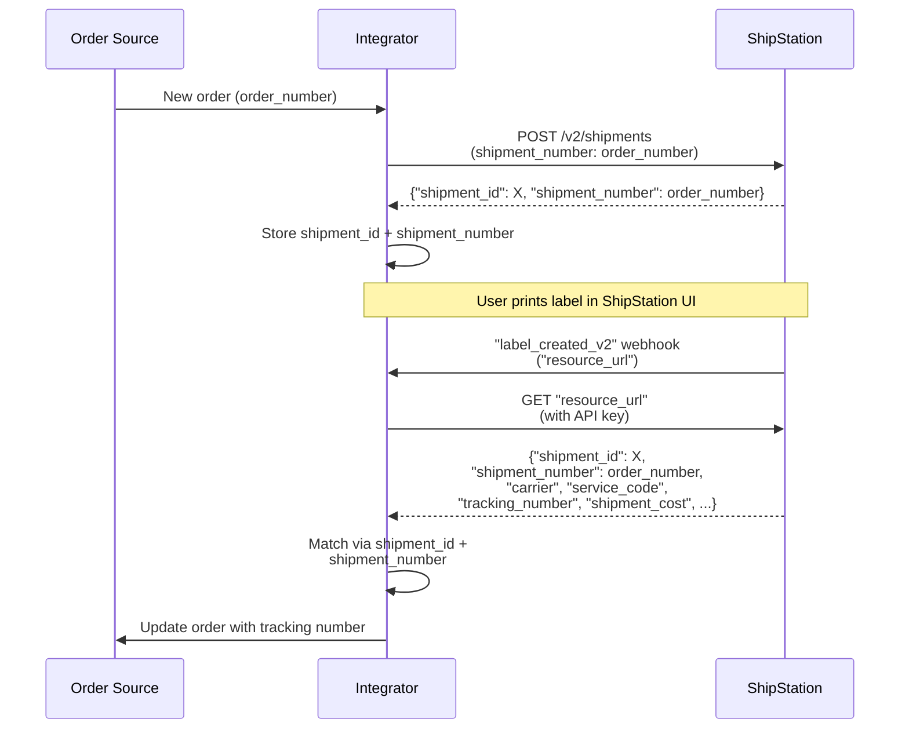

# Order to Shipment to Label

## Overview

Create a shipment in ShipStation via API, parsing your order number as `"shipment_number"`. Store the `"shipment_id"` from the response. When a user prints the label in ShipStation, a `"label_created_v2"` webhook is triggered containing a `"resource_url"`. Call that URL to fetch label details, then match the response using both `"shipment_id"` and `"shipment_number"` to find the order, and sync label data (`"carrier"`, `"service_code"`, `"tracking_number"`, `"shipment_cost"`) back.

## Flow

## References

- Official docs: [POST /v2/shipments](https://docs.shipstation.com/apis/openapi/shipments/create_shipments)
- Example webhook payload: [`webhooks/labels/label-created-v2.json`](../../webhooks/labels/label-created-v2.json)
- Example resource_url payload: [`webhooks/labels/label-created-v2-resource-url.json`](../../webhooks/labels/label-created-v2-resource-url.json)

## Notes

- **This is the core pattern for store integrations** where ShipStation does not have a pre-built connector. The majority of ShipStation pre-built integrations follow this same flow: order push from source → shipment creation → label created → label sync back to source.
- The webhook body is a **pointer only** (`"resource_url"`). Always call `GET "resource_url"` to retrieve the full label details.
- Match incoming labels to orders using **both** `"shipment_id"` and `"shipment_number"` from the `GET "resource_url"` response. A single order can spawn multiple shipments (split shipments, backorders, cancellations).
- UI webhook event name is "On Labels Created (V2)" but the webhook `"resource_type"` field will say `"LABEL_CREATED_V2"` — branch your code on `"resource_type"`.
- The label print is **user-initiated in the UI**, not API-driven. Integrator has no control over _when_ it's printed.
- Useful for syncing tracking numbers and label costs back to the order source in near-real-time.
