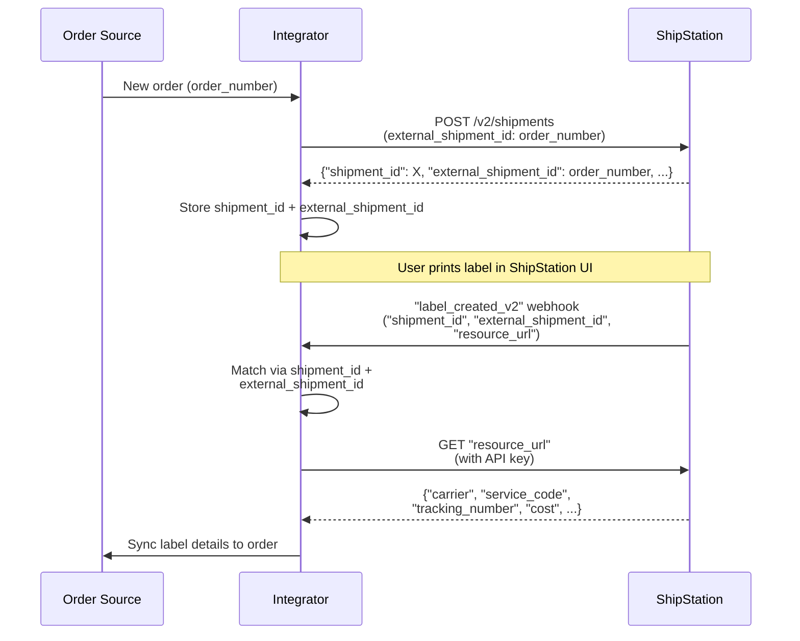

# Order to Shipment to Label — UI-Driven Label Print

## Short answer

Create a shipment in ShipStation via API, store the `"shipment_id"` and your order number as `"external_shipment_id"`. When a user prints the label in the ShipStation UI, ShipStation sends a `"label_created_v2"` webhook. Match the webhook back to your order using both `"shipment_id"` and `"external_shipment_id"`, call the `"resource_url"` to fetch label details (`"carrier"`, `"service_code"`, `"tracking_number"`, `"shipment_cost"`), and sync them back.

## Flow

## References

- Official docs: [POST /v2/shipments](https://docs.shipstation.com/docs/create-shipment-label)
- Official docs: [On Labels Created (V2) webhook](https://docs.shipstation.com/docs/on-labels-created)
- Example webhook payload: [`webhooks/labels/label_created_v2.json`](../webhooks/labels/label_created_v2.json)

## Notes

- Always store both `"shipment_id"` (ShipStation's internal ID) and `"external_shipment_id"` (your order number) when you create a shipment.
- Match incoming webhooks using **both** `"shipment_id"` and `"external_shipment_id"`. A single order can spawn multiple shipments (split shipments, backorders, cancellations).
- Webhook payload contains a **pointer** (`"resource_url"`), not the full label data. You must call `GET "resource_url"` with your API key to retrieve `"carrier"`, `"tracking_number"`, and `"shipment_cost"`.
- UI event name is "On Labels Created (V2)" but the webhook `"resource_type"` field will say `"LABEL_CREATED_V2"` — branch your code on `"resource_type"`.
- The label print is **user-initiated in the UI**, not API-driven. Integrator has no control over _when_ it's printed.
- Useful for syncing tracking numbers and label costs back to the order source in near-real-time.
