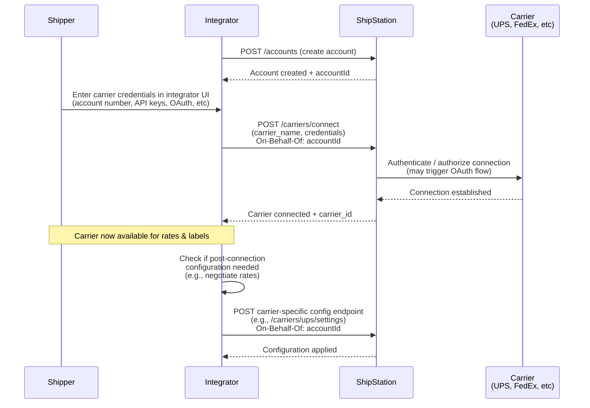

# Partner API BYOA Carrier Onboarding

## Overview

Connect a shipper's existing carrier account (UPS, FedEx, etc.) to ShipStation via the integrator's own UI, leveraging ShipStation's carrier connection API to handle authentication and onboarding.

## Flow

## References

- Carrier Connect Guide: [Connect a Carrier Account](https://docs.shipstation.com/apis/shipengine/docs/carriers/connect)
- UPS Integration Guide: [UPS Carrier Setup](https://docs.shipstation.com/apis/shipengine/docs/carriers/ups)
- Additional carrier guides: Check ShipStation docs for carrier-specific requirements (FedEx, DHL, etc.)

## Notes

- **This flow connects existing carrier accounts only.** BYOA onboarding does not enable ShipStation API Carriers (wallet funding, insurance, etc.). To offer ShipStation-funded carriers, use the [Carrier Portal](../partner%20api/carrier-portal-onboarding.md) flow or [ShipStation Elements](https://docs.shipstation.com/apis/shipengine/docs/elements/elements-guide).
- **Authentication varies by carrier.** Some carriers use OAuth (UPS), others use API keys or account credentials. The integrator UI must accommodate the authentication method required by each carrier. Refer to the [carrier connect guide](https://docs.shipstation.com/apis/shipengine/docs/carriers/connect) for carrier-specific details.
- **On-Behalf-Of header is required** when calling the carrier connection endpoint. This tells ShipStation which account the carrier is being connected to.
- **Post-connection configuration may be needed.** Some carriers require additional setup after initial connection (e.g., UPS negotiated rates, FedEx signature image). Check carrier-specific documentation and expose these configuration options in your integrator UI if applicable.
- The integrator owns the UX for collecting carrier credentials. This may include form fields, OAuth redirects, or API key inputs depending on the carrier and authentication method.
- Once a carrier is connected, it's available immediately for rates, labels, and tracking queries.
