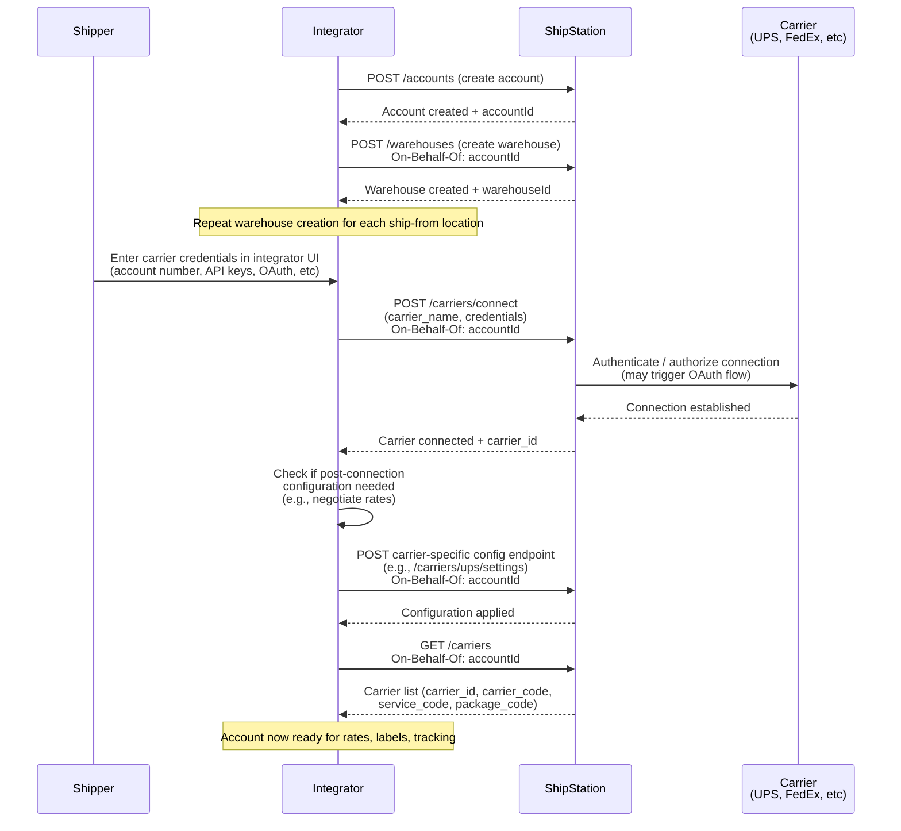

# Partner API BYOA Carrier Onboarding

## Overview

Onboard a partner account to ShipStation via the Partner API: create the account, define shipping locations as warehouses, connect a user's existing carrier account (UPS, FedEx, etc.) and retrieve carrier metadata needed for rates, labels, and tracking.

## Flow

## References

- Create Account: [POST /accounts](https://docs.shipstation.com/apis/shipengine/docs/partners/partner-integration-guide)
- Create Warehouse: [POST /warehouses](https://docs.shipstation.com/apis/shipengine/docs/reference/create-warehouse)
- Carrier Connect Guide: [Connect a Carrier Account](https://docs.shipstation.com/apis/shipengine/docs/carriers/connect)
- UPS Integration Guide: [UPS Carrier Setup](https://docs.shipstation.com/apis/shipengine/docs/carriers/ups)
- List Carriers: [GET /carriers](https://docs.shipstation.com/apis/shipengine/docs/reference/list-carriers)
- Additional carrier guides: Check ShipStation docs for carrier-specific requirements (FedEx, DHL, etc.)

## Notes

- **This flow connects existing carrier accounts only.** BYOA onboarding does not enable ShipStation API Carriers (wallet funding, insurance, etc.). To offer ShipStation API carriers, use the [Carrier Portal](../partner-api/carrier-portal-onboarding.md) flow or [ShipStation Elements](https://docs.shipstation.com/apis/shipengine/docs/elements/elements-guide).
- **On-Behalf-Of header is required** for warehouse creation, carrier connection, and carrier list queries. This header tells ShipStation which account the requests are for.
- Warehouses represent ship-from locations; you'll typically create one per fulfillment center or distribution hub the shipper operates.
- **Authentication varies by carrier.** Some carriers use OAuth (UPS), others use API keys or account credentials. The integrator UI must accommodate the authentication method required by each carrier. Refer to the [carrier connect guide](https://docs.shipstation.com/apis/shipengine/docs/carriers/connect) for carrier-specific details.
- **Post-connection configuration may be needed.** Some carriers require additional setup after initial connection (e.g., UPS negotiated rates, FedEx signature image). Check carrier-specific documentation and expose these configuration options in your integrator UI if applicable.
- The integrator owns the UX for collecting carrier credentials. This may include form fields, OAuth redirects, or API key inputs depending on the carrier and authentication method.
- Carrier metadata (carrier_code, service_code, package_code) must be stored by the integrator and used in downstream rate and label requests.
