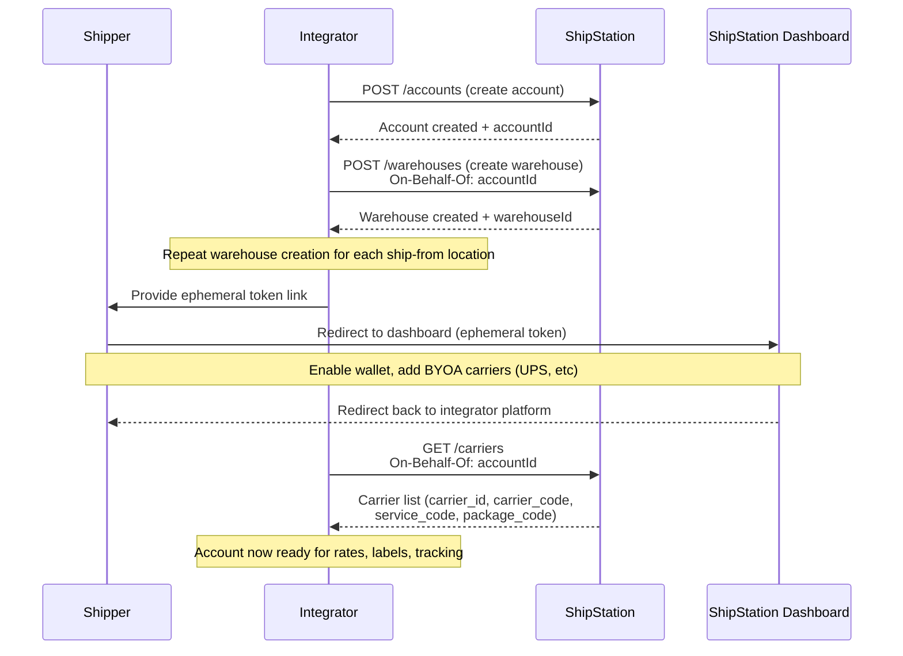

# Partner API Account Onboarding via Carrier Portal

## Overview

Onboard a partner account to ShipStation via the Partner API: create the account, define shipping locations as warehouses, enable carrier wallets through an ephemeral token redirect, and retrieve carrier metadata needed for rates, labels, and tracking.

## Flow

## References

- Official docs: [Partner Integration Guide](https://docs.shipstation.com/apis/shipengine/docs/partners/partner-integration-guide)
- Create Account: [POST /accounts](https://docs.shipstation.com/apis/shipengine/docs/partners/partner-integration-guide)
- Create Warehouse: [POST /warehouses](https://docs.shipstation.com/apis/shipengine/docs/reference/create-warehouse)
- Direct Login (Ephemeral Token): [Direct Login Guide](https://docs.shipstation.com/apis/shipengine/docs/partners/direct-login)
- List Carriers: [GET /carriers](https://docs.shipstation.com/apis/shipengine/docs/reference/list-carriers)

## Notes

- **On-Behalf-Of header is required** for warehouse creation, ephemeral token generation, and carrier list queries. This header tells ShipStation which account the request is for. Always include `On-Behalf-Of: <accountId>` in the request headers for these operations.
- Warehouses represent ship-from locations; you'll typically create one per fulfillment center or distribution hub the partner operates.
- The integrator platform receives the ephemeral token URL and redirects the shipper to the ShipStation Dashboard. The token is single-use and short-lived.
- After the shipper enables the wallet and adds carriers in the Dashboard, they're redirected back to your platform. At that point, call GET /carriers to fetch the newly available carrier metadata.
- Carrier metadata (carrier_code, service_code, package_code) must be stored by the integrator and used in downstream rate and label requests.
