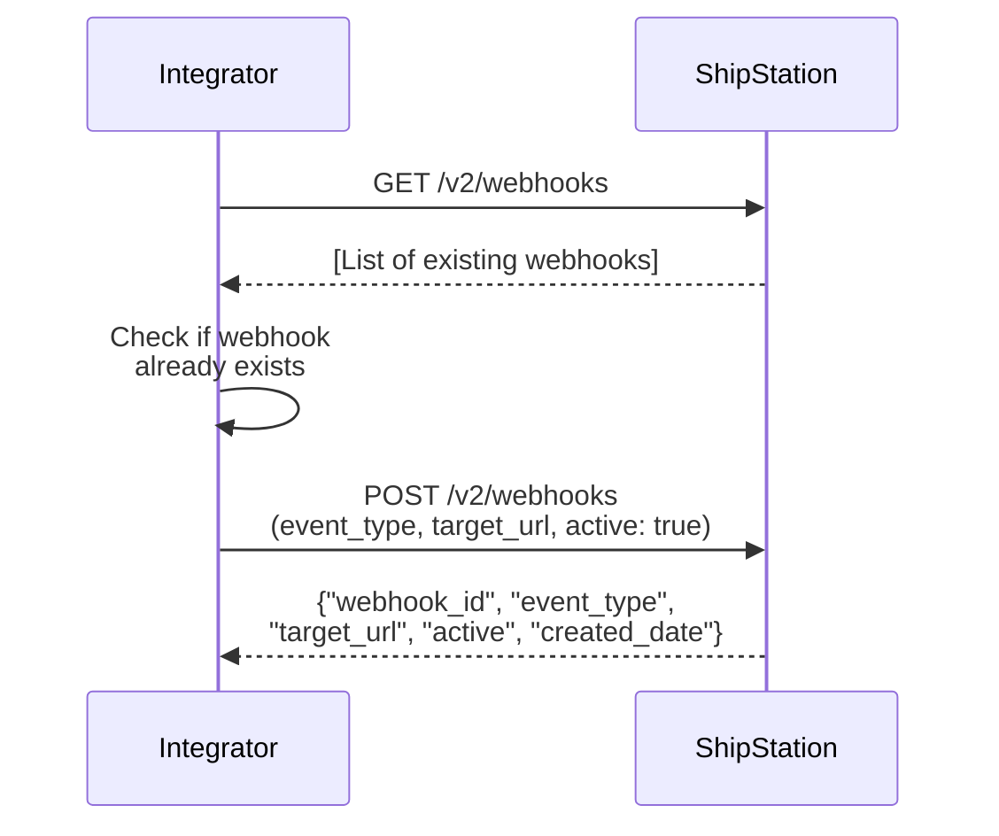

# Webhook Creation via API

## Short answer

Before creating a new webhook, first retrieve the list of existing webhooks to check what's already configured and avoid duplicates. Then call `POST /v2/webhooks` with your target URL and desired event type(s). ShipStation returns the new webhook details including the `webhook_id` for future reference.

## Flow

## References

- Official docs: [GET /v2/webhooks](https://docs.shipstation.com/apis/openapi/webhooks/list_webhooks)
- Official docs: [POST /v2/webhooks](https://docs.shipstation.com/apis/openapi/webhooks/create_webhook)

## Notes

- Always call `GET /v2/webhooks` first to see what's already configured. This prevents duplicate webhook registrations.
- You can register multiple webhooks for the same event type pointing to different URLs if needed.
- ShipStation returns a `webhook_id` — store this if you may need to update or delete the webhook later.
- Webhooks are active by default when created (`active: true`). Set `active: false` to register but disable initially.
