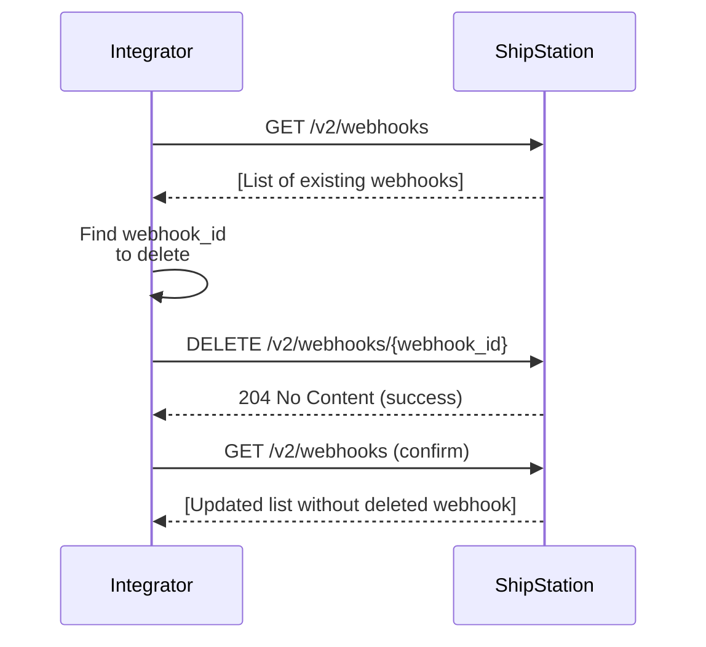

# Webhook Deletion via API

## Overview

To delete a webhook, first retrieve the list of webhooks to find the `webhook_id` of the one you want to remove. Then call `DELETE /v2/webhooks/{webhook_id}`. ShipStation removes the webhook. Optionally, call `GET /v2/webhooks` again to confirm the webhook is no longer in the list.

## Flow

## References

- Official docs: [GET /v2/webhooks](https://docs.shipstation.com/apis/openapi/webhooks/list_webhooks)
- Official docs: [DELETE /v2/webhooks/{webhook_id}](https://docs.shipstation.com/apis/openapi/webhooks/delete_webhook)

## Notes

- Always call `GET /v2/webhooks` first to retrieve the list and identify the correct `webhook_id` to delete.
- Once deleted, the webhook will stop receiving events immediately.
- Optionally call `GET /v2/webhooks` again after deletion to confirm the webhook is no longer registered.
- Deleting a webhook does not affect other webhooks or your ShipStation account configuration.
