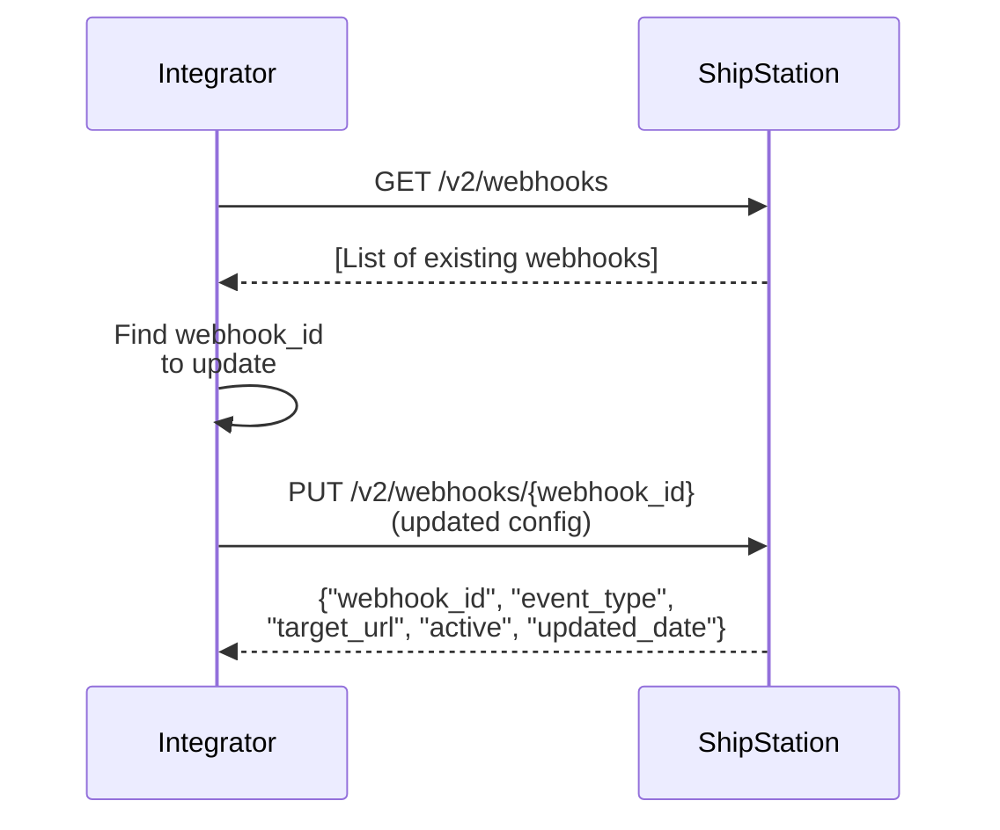

# Webhook Update via API

## Short answer

To modify an existing webhook, first retrieve the list of webhooks to find the `webhook_id` of the one you want to change. Then call `PUT /v2/webhooks/{webhook_id}` with the updated configuration (event type, target URL, active status, etc.). ShipStation returns the updated webhook details.

## Flow

## References

- Official docs: [GET /v2/webhooks](https://docs.shipstation.com/apis/openapi/webhooks/list_webhooks)
- Official docs: [PUT /v2/webhooks/{webhook_id}](https://docs.shipstation.com/apis/openapi/webhooks/update_webhook)

## Notes

- Always call `GET /v2/webhooks` first to retrieve the current webhook configuration and find the `webhook_id` you want to modify.
- Common update scenarios: changing the target URL (e.g., moving to a new server), enabling/disabling the webhook (`active: true/false`), adding or removing event types.
- You can update any field of the webhook configuration via the `PUT` endpoint.
