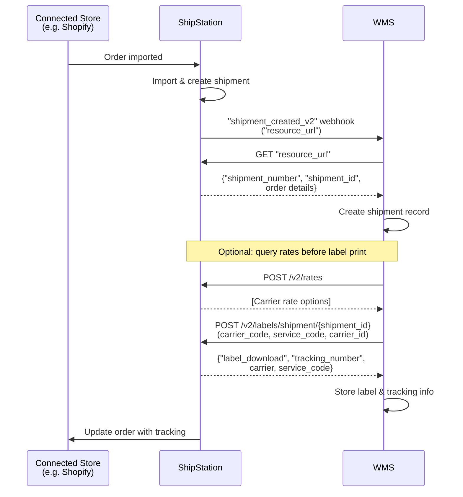

# Store Import to Shipment to WMS Label Creation — API-Driven

## Overview

Orders are imported from a connected store (e.g. Shopify) into ShipStation. ShipStation sends a `"shipment_created_v2"` webhook to your WMS. Your WMS calls the `"resource_url"` to retrieve shipment details and creates a shipment record. Optionally, your WMS calls `POST /v2/rates` to query shipping rates across carriers before creating a label. Your WMS then calls `POST /v2/labels/shipment/{shipment_id}` with your preferred carrier, service, and carrier ID to create a label. ShipStation returns label details including the `"label_download"` URL and `"tracking_number"`, which your WMS stores. ShipStation automatically updates the connected store with the label and tracking info.

## Flow

## References

- Example webhook payload: [`webhooks/shipments/new-order-created-v2.json`](../../webhooks/orders/new-order-created-v2.json)
- Example resource_url payload: [`webhooks/shipments/new-order-created-v2-resource-url-response.json`](../../webhooks/orders/new-order-created-v2-resource-url-response.json)
- Official docs: [POST /v2/rates](https://docs.shipstation.com/apis/openapi/rates/calculate_rates)
- Official docs: [POST /v2/labels/shipment/{shipment_id}](https://docs.shipstation.com/apis/openapi/labels/create_label_from_shipment)

## Notes

- Orders originate in the connected store and ShipStation imports them.
- Store both `"shipment_number"` (the order number from the connected store) and `"shipment_id"` (ShipStation's internal identifier). A single order can spawn multiple shipments due to split shipments, backorders, or cancellations.
- The `shipment_created_v2` webhook contains a **pointer only** (`"resource_url"`). Always call `GET "resource_url"` to retrieve full shipment details before creating a label.
- Calling `POST /v2/rates` before label creation is optional. Your WMS can query rates to evaluate carrier options, or skip rates and go straight to label creation with a pre-selected carrier.
- Label creation via `POST /v2/labels/shipment/{shipment_id}` is **API-driven**, not UI-driven. Your WMS has full control over when and which carrier is selected.
- The response includes `"label_download"` (URL to retrieve the label) and `"tracking_number"` for tracking purposes.
- ShipStation automatically syncs label and tracking info back to the connected store — your WMS does not need to handle this.
- Useful for automating label creation within a warehouse management system and maintaining real-time sync across all systems.
