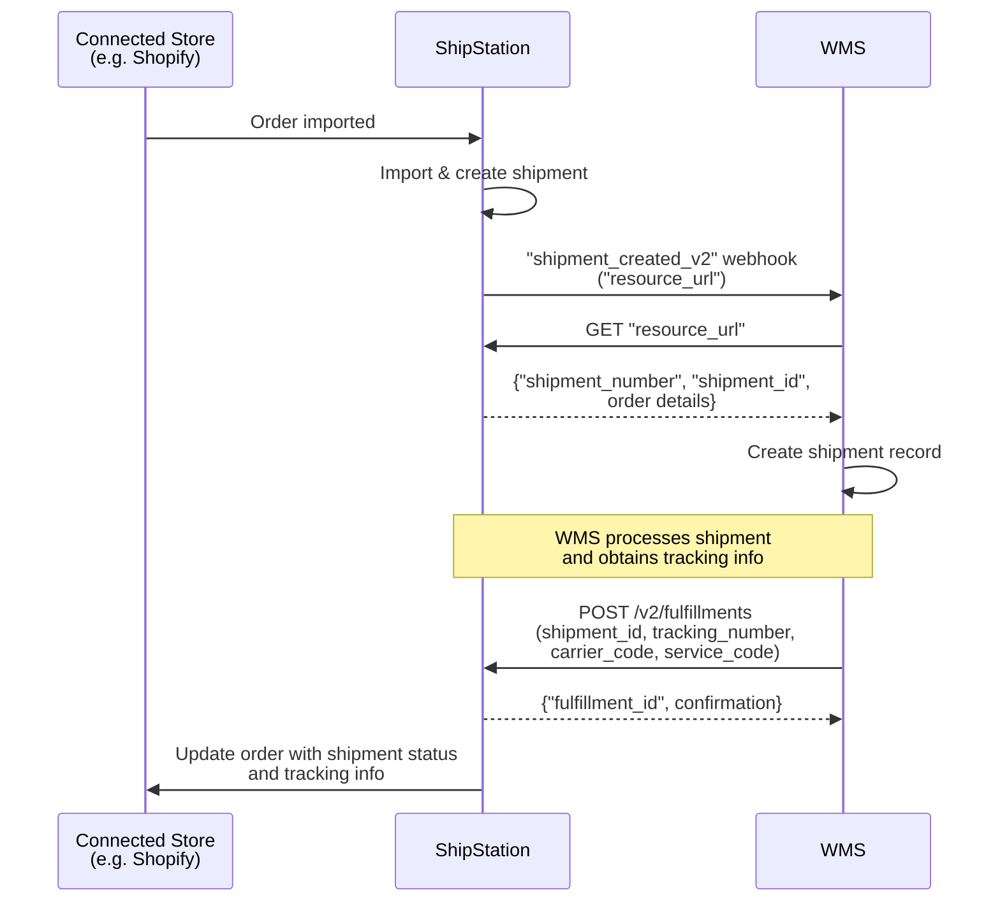

# Store Import to Shipment to WMS Fulfillment — API-Driven

## Overview

Orders are imported from a connected store (e.g. Shopify) into ShipStation. ShipStation sends a `"shipment_created_v2"` webhook to your WMS. Your WMS calls the `"resource_url"` to retrieve shipment details and creates a shipment record. Your WMS then calls `POST /v2/fulfillments` with the shipment ID, tracking number, carrier and service information to mark the shipment as fulfilled. ShipStation updates the connected store with the shipment status and tracking info.

## Flow

## References

- Example webhook payload: [`webhooks/shipments/new-order-created-v2.json`](../../webhooks/orders/new-order-created-v2.json)
- Example resource_url payload: [`webhooks/shipments/new-order-created-v2-resource-url-response.json`](../../webhooks/orders/new-order-created-v2-resource-url-response.json)
- Official docs: [POST /v2/fulfillments](https://docs.shipstation.com/apis/openapi/fulfillments/create_fulfillments)

## Notes

- Orders originate in the connected store and ShipStation imports them.
- Store both `"shipment_number"` (the order number from the connected store) and `"shipment_id"` (ShipStation's internal identifier). A single order can spawn multiple shipments due to split shipments, backorders, or cancellations.
- The `shipment_created_v2` webhook contains a **pointer only** (`"resource_url"`). Always call `GET "resource_url"` to retrieve full shipment details before creating a fulfillment.
- Creating a fulfillment via `POST /v2/fulfillments` is **API-driven**. Your WMS marks the shipment as fulfilled/shipped by providing tracking information and carrier details.
- The fulfillment creation confirms that the shipment has been picked, packed and has shipped from your warehouse.
- ShipStation automatically syncs fulfillment and tracking info back to the connected store — your WMS does not need to handle this.
- Useful for automating fulfillment workflows within a warehouse management system and maintaining real-time sync across all systems.
