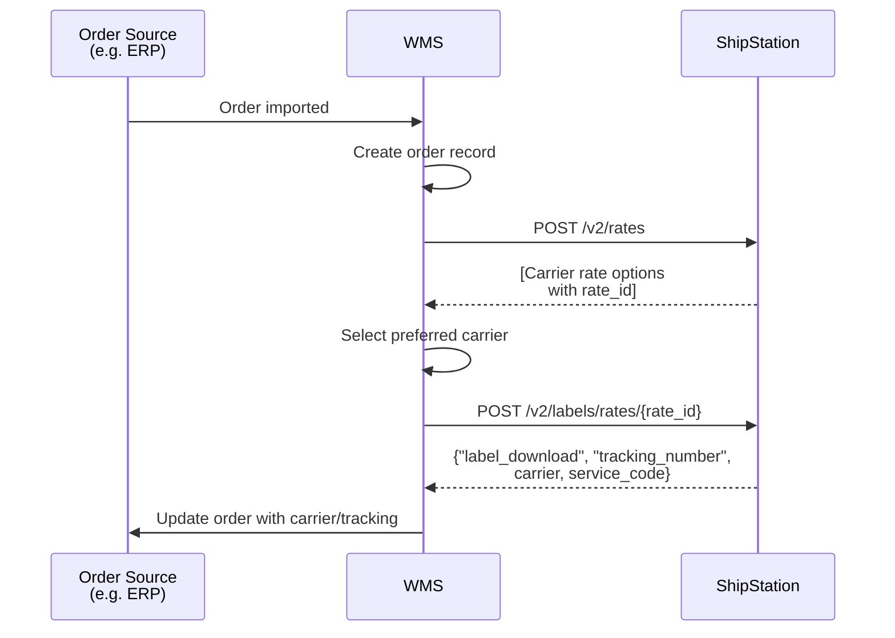

# WMS Rate Shop and Label Creation

## Overview

Orders originate in a system (e.g. ERP) and are sent to your WMS. Your WMS calls `POST /v2/rates` to rate shop across carriers. Based on the rates returned, your WMS selects a preferred carrier and calls `POST /v2/labels/rates/{rate_id}` to create a label using the selected rate. ShipStation returns the label details including `"label_download"` URL and `"tracking_number"`. Your WMS updates the order source with the carrier and tracking information. Alternatively, your WMS can combine rate shopping and label creation in a single request using `POST /v2/labels/rate_shopper_id/:rate_shopper_id`.

## Flow

## References

- Official docs: [POST /v2/rates](https://docs.shipstation.com/apis/openapi/rates/calculate_rates)
- Official docs: [POST /v2/labels/rates/{rate_id}](https://docs.shipstation.com/apis/openapi/labels/create_label_from_rate)
- Official docs: [POST /v2/labels/rate_shopper_id/:rate_shopper_id](https://docs.shipstation.com/apis/openapi/labels/create_label_from_rate_shopper) (alternative: combine rating and labeling in one call)

## Notes

- Orders originate in an external system and are pushed to your WMS. The WMS is responsible for all ShipStation interactions.
- Calling `POST /v2/rates` returns available carriers and services with a `rate_id` for each option. Your WMS can use business logic to select the best rate (lowest cost, fastest delivery, preferred carrier, etc.).
- After selecting a rate, pass the `rate_id` to `POST /v2/labels/rates/{rate_id}` to create a label. The label response includes `"label_download"` (URL to retrieve the label) and `"tracking_number"`.
- **Alternative approach**: Use `POST /v2/labels/rate_shopper_id/:rate_shopper_id` to combine rate shopping and label creation in a single request. This endpoint rate shops, selects the best rate based on your criteria, and returns a label — useful if you want to simplify the workflow.
- Your WMS is responsible for syncing carrier and tracking information back to the order source.
- Useful for warehouse systems that need to optimize shipping costs and maintain control over carrier selection before labeling.
